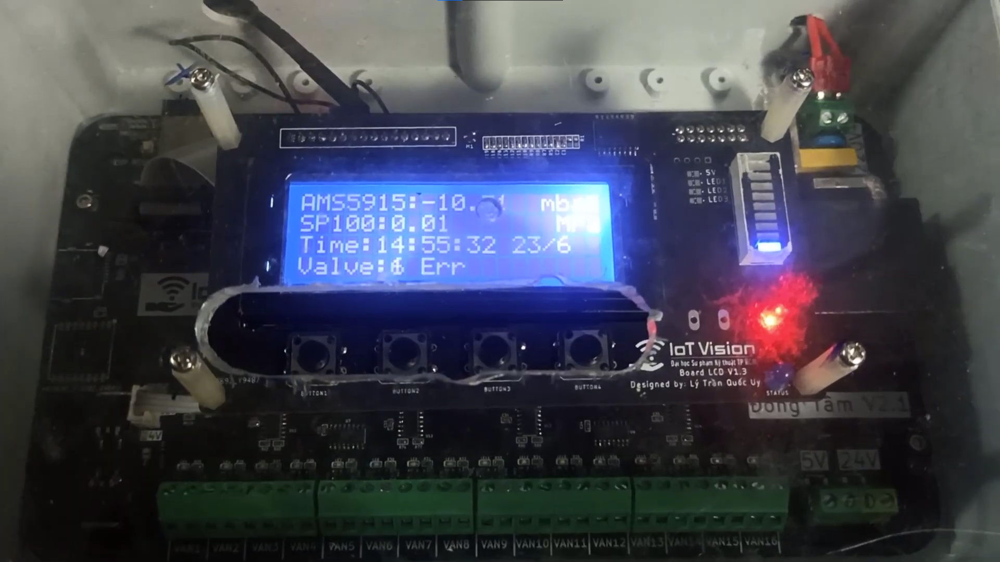

# Air Cleaning Machine Valve Controller


This project focuses on controlling 16 valves in sequence for an air cleaning machine. It includes the following features:

- Error Detection: Capable of detecting up to 16 faulty valves.

 - Pressure Monitoring: Collects pressure data from sensors.

 - Real-Time Data Transmission: Sends pressure values and valve error statuses to a server in real time.

 - User Interface: Equipped with a 20x4 LCD GUI for easy user interaction. A LED bar to indicate the pressure level, a red LED to signal errors, and a blue LED to show running status..

Check out [the older version of this project](https://github.com/IoTVision/DongTamV2)

Checkout these [project images](https://drive.google.com/drive/u/0/folders/1x6IVG3RRH-fNO5Y98BAA3cW-dD-tSMe1) for more infomation about this project.
# Hardware
Checkout [hardware layout repository](https://github.com/TM-khoa/DongTamHardwareV2.git) for detail about hardware components and structure
# ESP32 
## Software structure
```
ESP32/
│
├── components/
│   └── MySubmoduleESP32Library/
│
├── main/
│   ├── Communication/
│   │   ├── CRC16
│   │   ├── MessageHandle
│   │   ├── Protocol
│   │   └── UART
│   │
│   ├── GUI/
│   │   ├── ButtonGUI
│   │   ├── GUI
│   │   ├── GUI_Navigator
│   │   ├── PressureBar
│   │   └── StatusLED
│   │
│   ├── OnlineManage/
│   │   ├── Client_DNS
│   │   └── OnlineManage
│   │
│   ├── BoardParameter
│   │
│   ├── DongTamESP32
│   │
│   └── main.h
│
└── sdkconfig and ESP-IDF files

```
### 

### Communication Module: 
- Set up UART peripheral port for communication with STM32.
- Handle receiving and transmitting messages.
- Encode and decode message data based on the [Protocol](https://github.com/TM-khoa/MyProtocolCommunication) layer.
- Perform CRC16 redundancy checks on messages.

### GUI Module:
- **ButtonGUI:**
  - Read button inputs.
  - Send button events to the GUI_Navigator module.
  - Accelerate integer parameter changes if the user holds down a button.
- **GUI_Navigator:**
  - Change GUI screens based on received button events.
- **Pressure Bar:**
  - Control the LED bar level based on pressure values received from the sensor.
- **StatusLED:**
  - Turn on the red LED if any valve is faulty.
  - Turn on the blue LED under normal status.
- **GUI:**
  - Display network status and WiFi information to the user.
  - Provide a settings page for parameters.
  - Display the board status.

### OnlineManage Module:
- Handle WiFi and network startup.
- Synchronize with the NTP server time.
- Send pressure values to the server in real time.
- Send board information to the server.
- Send the current active valve status to the server.

### BoardParameter:
- Store user-defined parameter settings.
- Provide APIs for getting and setting parameter data for other modules.

### main DongTamESP32.cpp:
- Integrate all modules together.


# STM32
## Software structure
```
STM32/
│
├── STM32-Library/
│   └── MySubmoduleSTM32Library/
│
├── Driver/
│   └── HALDriver/
│
├── Core/
│   ├── Src/
│   │   ├── CRC16.c
│   │   ├── main.cpp
│   │   ├── MessageHandle.cpp
│   │   ├── ValveControlProcess.cpp
│   │   └── CubeMX generation .c files
│   │
│   └── Inc/
│       ├── CRC16.c
│       ├── main.cpp
│       ├── MessageHandle.cpp
│       ├── ValveControlProcess.cpp
│       └── CubeMX generation .h files
│
└── CubeMX generation files/

```
### Communication Module:
- Set up UART peripheral port for communication with ESP32.
- Handle receiving and transmitting messages.
- Encode and decode message data based on the [Protocol](https://github.com/TM-khoa/MyProtocolCommunication) layer.
- Perform CRC16 redundancy checks on messages.

### ValveControlProcess Module:
- Control the on and off sequence of valves based on user-defined settings.
- Collect pressure data from the sensor each time a valve is triggered and every 3 seconds consecutively.
- Check whether the currently triggered valve is faulty.

### main.cpp:
- Set up the timer peripheral for the valve control process.
- Update the onboard RTC using the NTP server time.
- Integrate all modules together.

# How to use
## Board
This project use ESP-IDF 5.2 framework and STM32CubeIDE 1.14

1. Clone this project


```
git clone https://github.com/TM-khoa/DongTamCodeV3.git
```
2. Into F103_DongTamV3 directory, update submodule STM32 library link:

```
cd F103_DongTamV3
git submodule update --init
```
3. Using STM32CubeIDE to compile, build and program STM32 

4. Into ESP32_DongTamV3 directory, update submodule ESP32 library link:
```
cd ESP32_DongTamV3
git submodule update --init
```

5. Using Visual Studio Code or ESP-IDF terminal to compile, build and program ESP32 

6. After completing these step above. If the board not connected to WiFi. The LCD GUI will show output below:
```
WIFI NOT CONNECT
AP: DongTamAP
Pass:dongtam
IP:10.10.0.1
```
The board creates an access point named DongTamAP with the password dongtam. Use a smartphone or laptop to connect to this access point, open a browser, and type 10.10.0.1 to connect to the ESP32 server. The server interface will appear as shown below:


Select your WiFi network to connect. If the connection is successful, the GUI will display the following output:
```
WIFI CONNECTED
<User WiFi SSID>
``` 

## Mobile app

__*Note*__: These instruction are only applicable on Android devices.

1. Open CH play store on user Android mobile devices
2. Searching for IoTVision app store and dowloading the app
3. Open IoTVision app and login user account 
4. If user login is successful. The app will appear as shown below
